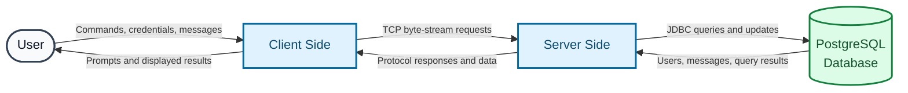

# UMMT: User Messaging and Management Tool

## Table of Contents

* [Description](#description)
* [Architecture](#architecture)
    * [Data Flow Diagram](#data-flow-diagram)
    * [Tokens & Status Codes](#tokens--status-codes)
        * [Client-Side Tokens](#client-side-tokens)
        * [Server-Side Codes](#server-side-codes)
* [Tools & Technologies](#tools--technologies)
* [Acknowledgements](#acknowledgements)

## Description

This is the project I made for learning, improving, and practicing my networking skills.
I have developed my own simple TCP based data transfer protocol, called SDP (Simple Dataflow Protocol), which simply 
passes data back and forth through the client-server connection using string byte-streams.

## Architecture

SDP is based on the TCP protocol, since it utilizes `java.net.Socket` and `java.net.ServerSocket` classes
under the hood. UMMT is a state-machine, the thread handling a user has 10 states: `LOGGED_OUT`, `IDLE`, `INBOX`, 
`OUTBOX`,`SENDMSG`, `ADDUSR`,`EXISTSUSR`, `UPDATEUSR`,`REMOVEUSR`, and `LISTUSRS`; each corresponding to a 
client-side status code. The `LOGGED_OUT` state is the starting state, and on a successful login attempt it transitions 
into the main central node, `IDLE`. From `IDLE` the machine can transition into every other remaining states, and after 
each successful state completion, the machine goes back to the `IDLE` state.

### Data Flow Diagram

### Tokens & Status Codes

Status codes along with their explanations:

#### Client-Side Tokens

##### Regular User Tokens
* `LOGIN`, followed by `USERNAME`, and `PASSWORD`- initiates the login request.
* `LOGOUT` - initiates the logout process.
* `EXIT` - initiates the disconnection process.
* `INBOX`, followed by optional `MODE` - initiates the inbox viewing request;
if a mode is provided, it filters the inbox according to the mode (currently only supports filtering by username). 
* `OUTBOX`, followed by optional `MODE` - initiates the outbox viewing request;
  if a mode is provided, it filters the outbox according to the mode (currently only supports filtering by username).
* `SENDMSG`, followed by `TARGET`, `DATE`, and `CONTENT`- initiates the message sending process.

##### Admin Tokens
* `ADDUSR`, followed by `USERNAME`, `PASSWORD`,`ADMINSTATUS`,`FIRSTNAME`,`LASTNAME`,`BIRTHDAY`,`GENDER`, and `EMAIL` -
initiates the creation of another user in the system.
* `EXISTSUSR`, followed by `USERNAME` - initiates the query to check whether a given username exists.
* `UPDATEUSR`, followed by `USERNAME`, and an arbitrarily long list of key value pairs `FIELD`, and `VALUE` - initiates the updating procedure. May result in no change.
* `REMOVEUSR`, followed by `USERNAME` - initiates the process of removing a user from the system. Double checks for accidental requests.
* `LISTUSRS` - initiates the process of listing all the registered users to the system.

#### Server-Side Codes

##### Fail Codes
* `ERROR|NOTLOG` - not logged in.
* `ERROR|ARGS` - invalid argument count.
* `ERROR|LOG` - already logged in/out.
* `ERROR|INBOX` - unable to load the inbox.
* `ERROR|OUTBOX` - unable to load the outbox.
* `ERROR|NOMATCH` - target does not exist.
* `ERROR|SENDMSG` - unable to send message.
* `ERROR|NOTADMIN` - not an admin.
* `ERROR|INVALID` - invalid input.
* `ERROR|ADDUSR` - unable to add user.
* `ERROR|EXISTSUSR` - unable to locate user.
* `ERROR|UPDATEUSR` - unable to update user.
* `ERROR|REMOVEUSR` - unable to remove user.
* `ERROR|LISTUSRS` - unable to list users.

##### Success Codes
* `OKAY|LOG` - successful login/logout.
* `OKAY|ADMIN` - user is admin.
* `OKAY|NOTADMIN` - user is not an admin.
* `OKAY|NOTLOG` - successfully logged out.
* `OKAY|EXIT` - successful exit.
* `OKAY|INBOXSTART` - sending inbox data.
  * `TO|FROM|DATE|CONTENT` - inbox data format.
* `OKAY|INBOXEND` - successfully sent inbox data.
* `OKAY|OUTBOXSTART` - sending outbox data.
  * `TO|FROM|DATE|CONTENT` - outbox data format.
* `OKAY|OUTBOXEND` - successfully sent outbox data.
* `OKAY|SENDMSG` - message successfully sent.
* `OKAY|ADDUSR` - successfully added user.
* `OKAY|EXISTSUSR` - user exists.
* `OKAY|UPDATEUSR` - successfully updated user with given fields.
* `OKAY|REMOVEUSR` - successfully removed user.
* `OKAY|LISTSTART` - sending user data.
  * `USERNAME|PASSWORD|ADMINSTATUS|FIRSTNAME|LASTNAME|BIRTHDAY|GENDER|EMAIL` - user list data format.
* `OKAY|LISTEND` - successfully sent user data.

## Tools & Technologies

* **Language:** Java
* **Build Tool:** Apache Maven
* **Database:** PostgreSQL, SQL
* **Database Connectivity:** JDBC, PostgreSQL JDBC Driver
* **Networking:** Java Socket API, TCP client-server communication
* **Concurrency:** Multithreaded server design with one thread per client connection
* **Development Environment:** IntelliJ IDEA
* **Core Java APIs:** `java.io`, `java.net`, `java.sql`, `java.time`, `java.util`

## Acknowledgements

Over the course of the 3 days I have worked on this mini-project, I have improved the protocol quite drastically, and documented its
internal working principles for easier understanding. As a developer coming from a strong C++ background,
learning Java from scratch has bolstered my interest towards the language. I hope to integrate Java more
closely to my software developer stack, and utilize its practicality to the full extent.
